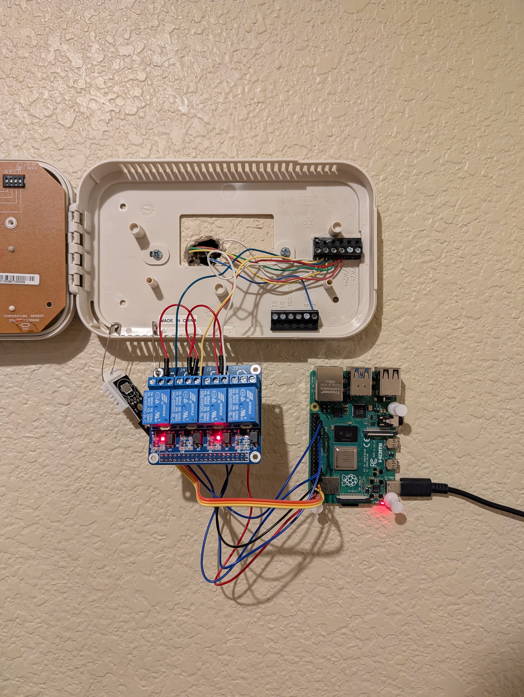

# Smart Thermostat



A DIY networked smart thermostat that controls 24V HVAC systems using raw Linux kernel GPIO interfaces (libgpiod), C++23, and JSON configuration files.

**Or: have you ever wanted to `scp` a JSON file to a Raspberry Pi in order to turn your heat on?**

## Features

- **Raspberry Pi 4B** running Raspberry Pi OS Lite
- **C++23** with `std::println`, `std::chrono`, and `std::ifstream`
- **Direct GPIO control** via libgpiod (Linux kernel interface)
- **4-channel relay module** for safe 24V HVAC control
- **DHT22 temperature sensor** for accurate readings
- **JSON-based scheduling** with 24-hour granular control
- **Hot-reload configuration** using inotify file watching
- **Systemd integration** for automatic startup and monitoring
- **5-minute hysteresis** to prevent HVAC short-cycling

## Hardware Setup

### Components
- Raspberry Pi 4B
- 4-channel relay module (5V trigger)
- DHT22 temperature/humidity sensor
- 24V HVAC system (standard R, G, Y, W wiring)
- Breadboard and jumper wires
- Safety pins and thumbtacks (for... mounting solutions)

### GPIO Pin Assignments
- GPIO 22 (white) - Heating relay
- GPIO 6 (yellow) - Cooling relay  
- GPIO 26 (green) - Fan relay
- GPIO 4 - DHT22 data pin

### Wiring
The relay module acts as a safe interface between the Pi's 3.3V GPIO and the HVAC's 24V system.
Each relay channel switches one HVAC wire (R/common connects to all).

## Software Architecture

### Core Components

**`main.cpp`**: Entry point, initializes thermostat state and starts main control loop

**`functions.h/cpp`**: Core thermostat logic
- GPIO initialization and relay control
- Temperature reading (via Python bridge to Adafruit DHT library)
- HVAC state management based on temperature ranges
- JSON config parsing and hot-reloading
- inotify-based file watching

**`temp.py`**: Temperature sensor interface
- Reads DHT22 sensor via Adafruit library
- Retries on transient sensor errors (DHT sensors are finicky)
- Returns temperature in Celsius to stdout

### Configuration

Create `config.json` with 24 hourly temperature ranges:

```json
{
  "schedule": [
    {"hour": 0, "min": 65, "max": 72},
    {"hour": 1, "min": 65, "max": 72},
    {"hour": 2, "min": 65, "max": 72},
    ...
    {"hour": 23, "min": 68, "max": 75}
  ]
}
```

The thermostat will:
- Turn on **heating** if temp < min
- Turn on **cooling** if temp > max
- Turn off everything if min ≤ temp ≤ max

Changes to `config.json` are automatically detected and applied immediately.

## Building

### Dependencies

**System packages:**
```bash
sudo apt update
sudo apt install libgpiod-dev nlohmann-json3-dev g++ make python3-pip
```

**Python packages:**
```bash
pip3 install -r requirements.txt
# Contents: adafruit-circuitpython-dht
```

### Compilation

```bash
make
```

Or manually:
```bash
g++ -std=c++23 -o thermostat main.cpp functions.cpp -lgpiod
```

## Running

### Manual Testing
```bash
./thermostat
# Ctrl+C to stop
# If relays stay on: ./close_relays
```

### Production (Systemd Service)

1. Copy `thermostat.service` to `/etc/systemd/system/thermostat.service`:


2. Enable and start:

```bash
sudo systemctl daemon-reload
sudo systemctl enable thermostat
sudo systemctl start thermostat
```

3. Monitor:

```bash
sudo systemctl status thermostat
journalctl -u thermostat -f
tail -f log.txt
```

## Project Journey

- **Hardware interfacing**: From blinkie to controlling my heater 
- **C++**: Moved from C-style code to C++23 features (`std::println`, `std::chrono`, `std::ranges`)
- **Linux kernel APIs**: Direct GPIO control via libgpiod, inotify file watching, trying and thinking better of writing bare syscalls
- **Circuit design**: Relay modules, breadboards, voltage isolation
- **Error handling**: Destructors, exception safety, and why manual memory management is a mistake
- **Build tooling**: Makefiles, language servers, clangd configuration

### Lessons Learned

- My Raspberry Pi 3B+ doesn't boot
- libgpiod is a maze of OOP and undefined jargon
- DHT sensors are unreliable; it's not my fault that sometimes it takes five times as long to get a reading
- It is never the last time I'm going to rewire the screw terminal
- I still can't believe it took until 2023 for C++ to invent the idea of a print statement
- Destructors are great except for when you need them to work
- JSON reigns supreme
- Systemd is just text files, and that's beautiful
- Safety pins are a valid mounting solution. Duct tape is not.

### Known Issues

- Relays will stay in the state they were in if the program stops (investigating watchdog pattern)
- Temperature sensor driver is in Python (might write my own so I can get C++ bindings)
- Relay wiring should be reorganized to use channels 1-3 and take wires directly from the wall rather than through a screw terminal

### Future Improvements

- [ ] Write native C++ driver for DHT22
- [ ] Implement watchdog pattern for safe shutdown
- [ ] Add web interface for remote control
- [ ] Add screen to display state and temperature
- [ ] Rewrite project for a Pi Pico to reduce space and computation
- [ ] Actually mount it properly (sorry, safety pins)

## Development Notes

Built while learning a Lily58 split keyboard. [I still haven't bound the curly brace](https://github.com/ains-arch/keyboard-config).

## License

MIT - Use at your own risk. Not responsible for freezing, overheating, or angry landlords.
Also, this project involves controlling residential HVAC systems, which are slightly more complicated than an LED.
Don't do anything stupid.
